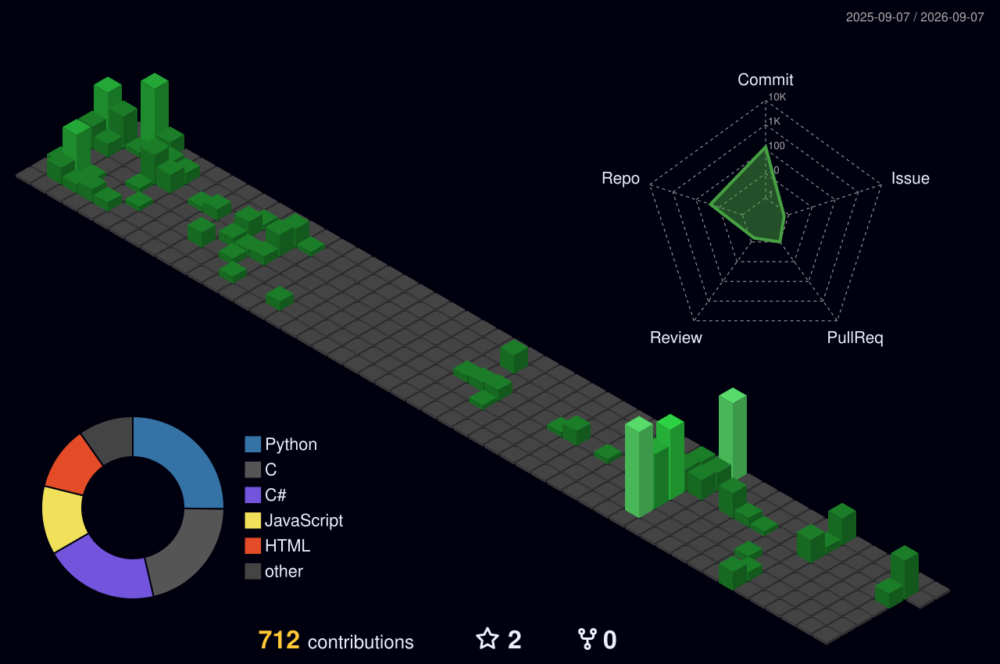

  Desenvolvedor C# sênior. Ciência da Computação na UNIJUÍ. 
  Sistemas que não podem falhar no fechamento: fiscal, contábil e financeiro.

  
  
  
  

---

Comecei em suporte de hardware e sistema operacional. Depois fui para ERP, gestão pública e crédito — sempre no código que as pessoas usam de verdade: lançamento, obrigação acessória, integração com o governo, fechamento de mês.

O que mais faço não é “criar tela”. É destravar o que trava operação.

### Problemas que costumo corrigir

- **Obrigação acessória que quebra no prazo.** Integrações SOAP e REST com o fisco: EFD-Reinf, SPED ECD/EFD, GIA (RS e SP), DIRF, DCTF, e-CredAc e PAD de prefeituras. Quando o arquivo não fecha, o município ou a empresa param.
- **Job que leva o dia inteiro.** Geração de PAD que saía em horas e passou a sair em minutos. Transferência de estoque entre filiais que ia de ~2 horas para ~3 minutos. O caminho quase sempre é o mesmo: query, I/O e processamento em lote.
- **SQL que derruba o banco.** Validação e reescrita de consultas caras em PostgreSQL, SQL Server, Sybase e Firebird — Dataset legado incluso.
- **Base que não conversa com o sistema novo.** Conversão e carga entre SGBDs diferentes para a operação continuar sem reescrever tudo.
- **Front travado em versão morta.** Migração de Angular 6 para Angular 15 em sistema no ar, sem jogar o legado fora.
- **Integração frágil e código que ninguém quer mexer.** Code review, backlog e limpeza com Clean Code em Java EE/EJB, ExtJS e C#/.NET. SOAP, REST e regras fiscais que mudam no meio do caminho.
- **Processo opaco.** Observabilidade com Elasticsearch e Grafana para achar o gargalo antes do usuário achar.

### Stack que uso de fato

**Linguagens e backend**

**Frontend**

**Dados e infra**

### Fora do expediente

Cursando Ciência da Computação. Mentor em Startup Weekend. Estudo compiladores, programação paralela (CUDA/MPI), criptografia e IA local com .NET + Ollama — o tipo de coisa que depois volta para o trabalho: async, performance e sistema que continua no ar sem depender de API cara.

  
  

  

